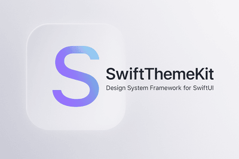

# SwiftThemeKit

**A modern, token-driven design system framework for SwiftUI**  
Easily create consistent, themeable user interfaces with full customization power — powered by a scalable design token system and environment-based styling.

[]()
[]()
[]()
[]()

<a href="https://www.producthunt.com/products/swiftthemekit?embed=true&utm_source=badge-featured&utm_medium=badge&utm_source=badge-swiftthemekit" target="_blank"></a>

<div style="display: flex; flex-wrap: wrap; gap: 12px;">
  
</div>

---

## Theme builder [WIP]

[SwiftThemeKit.com](https://swiftthemekit.com)

## ✨ Why SwiftThemeKit?

SwiftUI offers flexibility, but theming across an entire app is hard to scale. SwiftThemeKit solves this by:

- 🔄 Applying themes globally using `@Environment`
- 🧱 Using design tokens (color, spacing, typography, shape, etc.)
- 🔧 Letting you override *just what you need*—no subclassing or brittle modifiers
- 🧪 Supporting previewing themes and snapshot testing

---

## 🔧 Features

- 🎨 Complete light & dark theming system with token override support
- 🧩 Drop-in UI components: `Button`, `TextField`, `Checkbox`, `Card`, `RadioGroup`, etc.
- 💡 Declarative `.applyTheme*Style()` modifiers for composability
- ♿️ Built with accessibility and contrast in mind
- 🔌 Plug-and-play: just add `ThemeProvider` and you're ready

---

## 🚀 Quick Start

1. **Wrap your root view with `ThemeProvider`:**

```swift
@main
struct MyApp: App {
    var body: some Scene {
        WindowGroup {
            ThemeProvider {
                ContentView()
            }
        }
    }
}
```

2. **Use themed components:**

```swift
struct ContentView: View {
    @State private var isEnabled = false
    @State private var username = ""

    var body: some View {
        VStack {
            Button("Primary Button") { }
                .applyThemeButtonStyle()

            Checkbox(isChecked: $isEnabled, label: "Enable Feature")

            TextField("Username", text: $username)
                .applyThemeTextFieldStyle()
        }
    }
}
```

---

## 🎨 Design Tokens

SwiftThemeKit uses a modular token-based system:

### 🖌 Color Tokens
- `primary`, `secondary`, `error`, `background`, `surface`
- On-color variants: `onPrimary`, `onError`, etc.

### 🔤 Typography
- Display, headline, body, label, button fonts
- Font sizes, weights, line spacing

### 📏 Spacing & Shape
- Spacing: `xs`, `sm`, `md`, `lg`, `xl`, `xxl`
- Radius: corner tokens (`sm`, `md`, `lg`)
- Shadow elevations: `level1`, `level2`, `none`

---

## 🧩 Core Components

### ✅ Buttons
- Variants: `.filled`, `.tonal`, `.outlined`, `.elevated`, `.text`
- Role support (e.g., `.destructive` uses error color tokens)

### ✅ Inputs
- `TextField`: outlined, filled, underlined
- `Checkbox`, `RadioButton`, `RadioGroup`

### ✅ Card
- Customizable padding, elevation, background
- Shadow and shape tokens applied via environment

---

## 🛠 Customizing Themes

You can create your own themes using token structs:

```swift
let customTheme = Theme(
    colors: .customColors,
    typography: .customTypography,
    spacing: .customSpacing,
    shapes: .customShapes
)
```

Or override parts of the environment:

```swift
MyView()
    .font(.headlineMedium)
    .padding(.xl)
    .clipShape(.rounded)
```

---

## 📦 Installation

Use [Swift Package Manager](https://swift.org/package-manager/) and select the latest release:

```swift
dependencies: [
  .package(url: "https://github.com/Charlyk/swift-theme-kit.git", from: "<latest_version>")
]
```

---

## 🧪 Screenshots

Click to view full-size previews from snapshot tests:

- [Typography](DemoApp/SwiftThemeKitDemo/SwiftThemeKitDemoTests/__Snapshots__/SwiftThemeKitDemoTests/testExampleViewSnapshot.TypographyView.png)
- [Buttons](DemoApp/SwiftThemeKitDemo/SwiftThemeKitDemoTests/__Snapshots__/SwiftThemeKitDemoTests/testExampleViewSnapshot.ButtonsView.png)
- [Cards](DemoApp/SwiftThemeKitDemo/SwiftThemeKitDemoTests/__Snapshots__/SwiftThemeKitDemoTests/testExampleViewSnapshot.ShapesView.png)
- [Checkboxes](DemoApp/SwiftThemeKitDemo/SwiftThemeKitDemoTests/__Snapshots__/SwiftThemeKitDemoTests/testExampleViewSnapshot.CheckboxesView.png)

---

## 🧠 Best Practices

- Prefer `.applyTheme*Style()` over custom modifiers
- Use semantic tokens (e.g., `themeColor.primary`) instead of raw colors
- Override per-view styles using `View.theme*()` modifiers
- Preview multiple themes using SwiftUI `ForEach`

---

## 📋 Requirements

- iOS 14+, macOS 11+, tvOS 15+, watchOS 7+
- Swift 5.5+

---

## 🤝 Contributing

We welcome issues and PRs!  
Check the [CONTRIBUTING.md](CONTRIBUTING.md) for setup and guidelines.

---

## 📄 License

MIT. See [LICENSE](LICENCE) for details.

---

## 🔍 Keywords

`swift`, `swiftui`, `design-system`, `ui-kit`, `dark-mode`, `theme`, `component-library`, `design-token`, `sdk`
